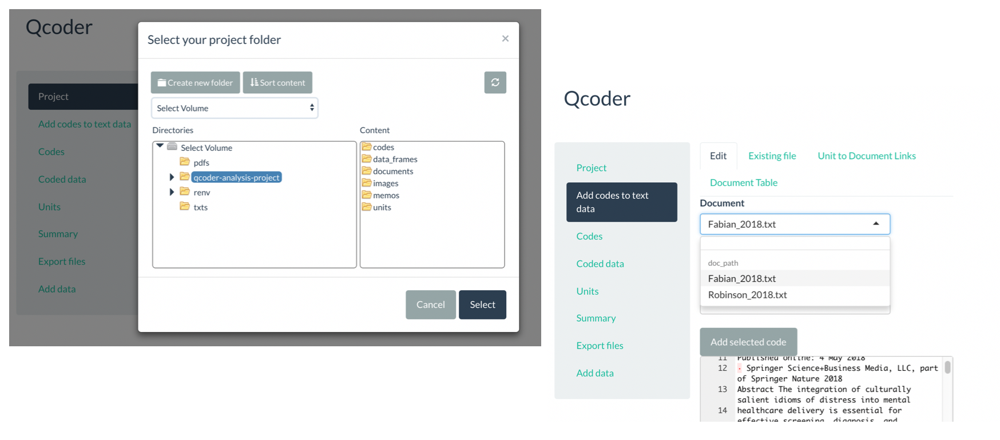

# Background
This repository was created as part of the Digital Humanities unit within Masters of Research at Macquarie University. It is a proof of concept (POC) that attempts to use digital tools and techniques for analysing qualitative data. Moreover, attempts have been made to automate testing via continuous integration. 

This PoC is a lightweight and easy-to-use tool for analysing qualitative data in R. This repository provides instructions and an installation script for running this tool in R. This tool can be used for any textual data, such as: interview transcripts, fieldwork notes, and primary documents.

This R script uses the qcoder package at https://github.com/ropenscilabs/qcoder. 

You can view my Notebook at http://rpubs.com/Savard/POC-Notebook.


# Table of Contents
- [Outline of the project](#outline)
- [Installation](#installation)
- [Setup](#setup)
- [R Script](#script)
- [Results](#results)
- [Issues](#issues)
- [Future direction](#future)
- [License](#license)

# Outline
For this PoC, I searched Macquarie University's Library and found two pdf documents that were relevant to my MRes thesis. These were downloaded and saved to my PoC repository. 

I then used R to:
- Create a folder called 'txts'
- Convert the pdfs to txt files 
- Move the txt files to the 'txts' folder
- Import qcoder package 
- Import units and codes for textual analysis 
- Build a path between the txt files and R 
- Reduce repeitive work by integrating all of these processes

# Installation
Go follow the instructions at https://www.r-project.org if you need to install R. 

Alternatively, you can run the following command in OSX Mac terminal:
```xcode-select --install
/usr/bin/ruby -e "$(curl -fsSL https://raw.githubusercontent.com/Homebrew/install/master/install)"

# Homebrew PATH
echo "export LC_ALL=en_US.UTF-8" >> ~/.bash_profile
echo "export LANG=en_US.UTF-8" >> ~/.bash_profile
echo "export PATH=/usr/local/bin:$PATH" >> ~/.bash_profile && source ~/.bash_profile

brew install r
echo 'Sys.setlocale(category="LC_ALL", locale = "en_US.UTF-8")' >> ~/.bash_profile

brew install openblas
brew install r --with-openblas
echo 'Sys.setlocale(category="LC_ALL", locale = "en_US.UTF-8")' >> ~/.bash_profile

brew cask install rstudio
```

# Setup
In order for this tool to work you need to download the [proof-of-concept zip file](proof-of-concept.zip) and save it to your Desktop as 'proof-of-concept'. Follow the instruction in this README to run the R script, for a more detailed description of how I used the script to run my PoC visit my RNotebook at: http://rpubs.com/Savard/POC-Notebook.

## Set working directory
In order for this PoC to work, users must set their working directory to the 'proof-of-concept' directory (this should have been saved on the Desktop. To set your working directory, run: 

```Rscript
setwd("$HOME/path/to/proof-of-concept")
```
For example, 
```Rscript 
setwd("/Users/sophieavard/Desktop/proof-of-concept")
```

## R renv
In order to ensure a consistent environment across multiple machines, use the ```renv.lock``` file to install the exact R packages. To do this, follow these steps:
1. ensure your working directory is set to the 'proof-of-concept' folder (follow the steps outlined above)
2. ensure that the ```renv.lock``` file is in this directory (if it is not there, it can be located [here](proof-of-concept/renv.lock)
2. execute ```renv::init()``` in R to automatically install the packages declared in that lockfile into your own private project library. 

By following these steps, you will be able to work within the project usign the exact same R packages. For further instructions on renv go to: https://rstudio.github.io/renv/

# Script
For deployment instructions, follow the step-by-step guide below or in my POC notebook at: http://rpubs.com/Savard/PoC

Entire script can be found [here](poc-script.txt)

## Install packages
To install the latest development version of the required packages, run:

```Rscript
#packages for pdf to txt
install.packages('plyr', repos = "http://cran.us.r-project.org")
install.packages("pdftools")
library(pdftools)

#packages for textual analysis
install.packages("devtools")
devtools::install_github("ropenscilabs/qcoder")
library(qcoder)

```

## Pdf to Text 
As the textual analysis requires the use of txt files, users need to convert pdf documents into txt. To do this, run the following script in RStudio:

```Rscript
#creates variable called file.names that builds path to the pdfs 
file.names <- dir(path="pdfs", pattern =".pdf", full.names=TRUE)

#this forloop converts the pdfs to text
for (file in file.names) {
  text <- pdf_text(file)

  #gsub replaces all matches of "pdf" and returns a string vector of "txt"
  output.file <- gsub("pdf", "txt",file)
  #print argument returns a visiable output
  print(output.file)
  print(file)
  #write the data to a file
  write(text, output.file)
}

```
Once you have have run this script, check the 'txts' folder in the proof-of-concept directory to make sure that the converted files are there.


## Importing data
Firstly, ensure that your working directory is proof-of-concept:

```Rscript 
getwd()
```

For the purposes of this project the user will be using a project that has already been created. For future references, if you want to create an empty project, run:
```Rscript
create_qcoder_project("insert-peroject-name-here")
```

To import the data proof-of-concept data into Qcoder, run: 
```Rscript
import_project_data(project = "qcoder-analysis-project")
```

To build the paths to the data to be importated and to the dataframes where the imported data is to be stored, run: 
```Rscript
project_name = "qcoder-analysis-project"
file_name <- "Fabian_2018.txt"
#creates a path to the data
docs_df_path <-"qcoder-analysis-project/data_frames/qcoder_documents_qcoder-analysis-project.rds"
#creates a path to the codes
codes_df_path <- "qcoder-analysis-project/data_frames/qcoder_codes_qcoder-analysis-project.rds"
file_path <- "qcoder-analysis-project/documents"
dir("qcoder-analysis-project/documents")
```

Now copy the files in 'txts' and place them in the 'documents' folder within the qcoder_analysis_project. To do this, run:

```Rscript
rawPath <- "~/Desktop/proof-of-concept/txts"
datafiles <- dir(rawPath, "*.txt", ignore.case = TRUE, all.files = TRUE)
file.copy(file.path(rawPath, datafiles), file_path, overwrite = TRUE)
```
Note, the 'rawPath' is the file path to the txts folder within the proof-of-concept directory. This may change depending on where the user has saved this directory. 

If following the instructions in the PoC RNotebook, make sure you adjust the rawPath from ```rawPath <- "~/Desktop/Sophie-Avard-Proof-of-Concept/proof-of-concept/txts"``` to ```rawPath <- "~/Desktop/proof-of-concept/txts"```


Check the 'documents' folder in the qcoder_analysis_project to make sure that the text files have been copied into the folder.

To read the data and codes into the system, run:
```Rscript 
new_dataframe <- readRDS(docs_df_path)
read_code_data(project_name = project_name)
codes_dataframe <- readRDS(codes_df_path)
```
Lastly, to open the qcoder analysis, run:
```Rscript
qcode(use_wd=TRUE)
```

## Coding the data 
To code the data, select the qcoder-analysis-project folder then click 'Reload project for data updating'. Next, click 'add codes to text data' in the left panel. The two text files should appear in the drop-down menu under 'Document'. 




If the documents are not in the drop-down menu, go to the [Issues](#issues) section and read how to fix it. 

For the purposes of this PoC, I have provided examples of how I coded the two txt files in the proof-of-concept directory. Using the Shiny app, codes can be assigned to text in two ways:

1. Surround the text to be coded with (QCODE)(/QCODE){#tag}. For example: 

```(QCODE)This text will be assigned a tag labelled 'example'.(/QCODE){#example}```

2. To use an existing code (see example below), highlight the text to be assigned a code, select the code, click ```add selected code```

When you are finished with coding the documents click ```save changes``` button.

Here is an example of the codes that were used to tag the files in this proof of concept. This must be a csv format and it must be saved in the 'codes' folder within the qcoder_analysis_project.


Further instructions on how to code data using qcoder can be found at https://github.com/ropenscilabs/qcoder. 

For the purposes of this PoC I have provided an example of coded data in the [Results](#results) section. 

# Results
This is an example of data that I have coded in the Shiny app: 


This is an example of the data that I exported as a csv format: 
- doc: this is the value that users assign to each document 
- qcode: this is the code of that particular segment of text
- text: is the segment of text that has been coded


# Issues
At this stage, the Qcoder application does not save coded data when the R session ends. This is due to a bug in the Qcoder package that is out of my control. As such, data must be coded and extracted within a single session. This is a work in progress and is a high priority development item. 

Moreover, occasionally the texts do not load within the 'add codes to text data' section in the shiny app - I am unable to fix this as it is a bug in the shiny app itself. To check whether to error is in the script or in the shiny app, check the 'documents' folder in the qcoder-analysis-project to make sure it contains two text files: Fabian_2018 and Robinson_2018. If both text files are in the folder it seems the script has worked. Follow these instructions to get the data in the app:
1. Open the shiny app again using ```qcode(use_wd=TRUE)``` 
2. In the left panel go to 'add data' 
3. Click 'select file' 
4. Select the two documents
5. In the left panel go to 'add codes to text data' and click the drop-down box under 'Document' 

This error only occurs in the shiny app occasionally. Most of the time, the user should be able to run the script and simple select the document from the drop-down box. 

# Future
1. It is important that the bug within the shiny app is fixed so that the data loads each time. 
2. I am currently working on being able to save and re-open qcoder sessions in R. 
3. At this stage, the script cannot be run through terminal due to the ui and server of the shiny app. I am working towards being able to run the script through the terminal command ```Rscript qcoder.R```
4. I am also working towards creating my own Shiny app for this Rscript so that it can be run easily through Chrome browser.
5. Lastly, I am working on a script that will assign a column to the csv file for references. This script will used the document unit (eg. "1") and the document name (eg. "Fabian_2018") to automatically create an in-text references that can be pasted into my thesis. 

# License
[](https://www.gnu.org/licenses/gpl-3.0)

